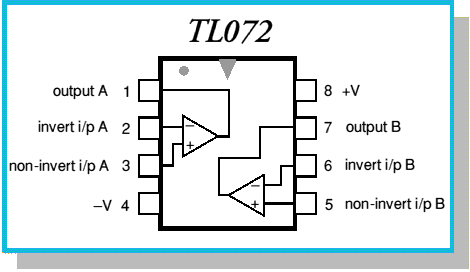
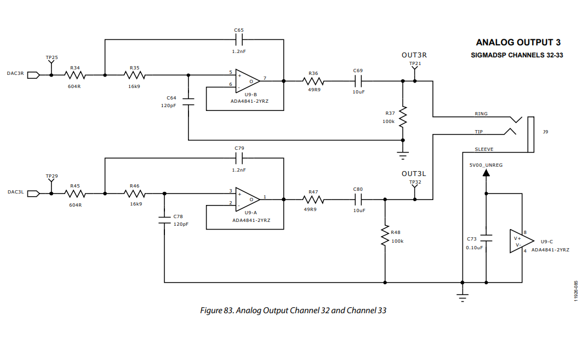

Reverse Engineering some AliEx Products...

# ADAU1452 + AD1938

| This was 3 days of brainfuug, feel free motivating me publishing such stuff. | <a href="https://www.buymeacoffee.com/mariosgeu" target="_blank"></a> |
|---|---|

## ADAU1452 board

### Specs

Power consumption (ADAU+AD1839) 466mA @ 5V

[SPI Flash mem](http://www.zettadevice.com/upload/file/20150821/DS_Zetta_25Q16_RevA_20171120.pdf) "25Q16" is a 16Mbit thing which looks pretty standard.

[Here are some images](IMAGES.md) of the board layouts, that's all you get but it is almost as good as a schematic.

### Connections

| Port | Func | Checked ? |
|---|---|---|
| AD2 | Poti | ??? Sort of.. | 
| MP7 | Switch 1 | YES, does things |
| MP6 | Switch 2 |
| MP9 | Switch 3 |
| | |
| MP11 | Blue | YES |
| MP12 | Red | YES | 
| MP13 | Green | YES |


## CODEC AD1938

This needs the 3.3V from the DSP board because it does not have it's own regulator.

In the **default setting** with the mode jumper at 2-3 position this will be configered to
* 192kHz TDM mode.
* No BitClock (BCLK) needed, the internal PLL is set to generate a master clock from the DLRCLK signal.

### Setup 

The CODEC board has a 8 pin MCU (STC15W101 Vcc@2 Gnd@4) on it, which sends init data to the CODEC. It reads the jumper position (2 bits ? or analog values ? No more likely 2 bits with pullups, pin 3 is GND) and then adjust what it's writing...  Here is the data...

The CODEC is set up by writing 24bit sequences over it's control SPI port. 
1. byte is the ```chip address << 1 | R/W``` this is allways 0x08 for writing access
2. byte is the register address to write
3. byte is data

(I skip adr 06-0D these are the DAC attenuators, allways set to 0)

Column 1 is the plain data which is send when jumper is at 2-3 (default position, TDM 192kHz)
Column 2 is the difference in data when jumper is removed (48kHz TDM?)
Column 3 is the difference when all are connected = all grounded. TODO!

| ChipAdr RegisterAdr Data (2-3) | data (open) | [1-2-3] | Reg Name | Meaning |
|---|---|---|---|---|
| 08 00 BE |    | | PLL0 | PLL=on, INPUT 768 ???, XTAL=off, pllsrc=DLRCLK, ADC,DAC=on <br>(PLL is set to follow the LRCLK, no BCLK signal is needed.) |
| 08 01 F8 |    | | PLL1 | DAC+ADC clk src = PLL, volt ref = on
| 08 02 44 | 40 | | DAC0 | 192(48)khz, SDATA offset to the LR to 0 !!! (Left justified ?), TDM
| 08 03 0E | 0C | | DAC1 | Slave, BCLK from BCLK pin???, BCLK pol = "normal", LRpol=left high, BCLK per frame 512 (256) Haeh???
| 08 04 C0 |    | | DAC2 | 24bit non inverted
| 08 05 00 |    | | DAC MUTE | = Unmute all |
| 08 0E 80 | 00 | | ADC0 | Sample Rate 192 (48), unmute
| 08 0F A0 |    | | ADC1 | TDM 24bit SDATA offset = 1 !!! Ahhh Why
| 08 10 36 | 26 | | ADC2 | LR=50/50, BCLK-rising edge, LR=Left high, Slave, BCLK per frame 256 (128), CLK source = BCLK !!! Haehhh?
| | | |

Hmm some values look kind'o messi. Would I like to unsolder that chip and ground all control pins to get the default config ??? I think then it needs a MCLK, which is not on the board. :-( the ADI eval board the ctl pins all grounded and MCLK is driven by MCLK out from the DSP. This could work.

### OpAmps ?

WQFN marking: ```ovii TI541```  or  ```OVII TI521``` ???


## Programming Experience

Things I did first:
* Solder in the useless selfboot jumper and set it to not self boot. (Because I managed to "clear" the flash and it started something strange) So now after power up, not much happens (LED goes on dimmed ? Which outputs are on MP11-13? Thats all LRCLK-In[1-3] ok then this should duty cycle somehow.)
* Removed the Jumper on the CODEC in hope to get this into some kind of 48kHz TDM mode.

Mhm yes SigmaStudio managed to download a programm via SPI. It lights up the LEDs and produces distorted audio.

Did not figure out the correct I2S port settings. DAC seems to do after setting it to LeftJustified format.. Is that because the CODEC register 0x02 was set to 0x44 - it's a SDATA offset of 0 ?? Why ??? Is I2S bad?

Witing to Flash mem failed at first but is doing things anyway ? Unable to boot usefull stuff. Original content seems to be gonesky.

### Progress 1.

* Configured the TOS SPDIF input, this can be read in the 1452 EVAL board docu by ADI. This works. 
* Aaaand it outputs to the DAC. Buuuuut, with full volume it distorts ! Is that an analog problem ??? So without the 

#### Analog Problem ?

CODEC docs say: Full-Scale Output Voltage 0.88 (2.48) V rms (V p-p). What comes out then ? Meassuring... so I added an Signalsource which outputs a sinus with 1kHz @ 0db - should draw a nice sinus with 2.48Vpp at the output right ?

| | What | Value |
|---|---|---|
| DAC out | Vp-p | 1.94 V |

Looks exactly like a sinus right? Grr what the hack...

.png)

Pin FILTER (35) is a foltage reference. 1.5V
Pin CM (38) .. can be used to bias external opamps... 1.5V
Both are second pin at the 36 edge. It goes onto the 4 caps next to this edge.

The OpAmps seem to run on 5V ? Mhm The neg power rail goes onto that backside T rail which is visible from the below.

The PCB is not quite what the picture shows, the new one has WQFN opamps and bit less jumperstuff near the USB port.

Here is a tl072 for reference



How the out stage should look like...



The OpAmp circuit is similar to the official EVAL board.. FILTER and CM pins have 1.6V, DAC outputs are 1.5V Should be ok, right ?


# Moans and Nickls !?

The boards for CODEC and DSP have different sizes, yeah who needs casing anyway.

CODEC OpAmps run on the main and only 5V rail !? It's noisy isn't it.


